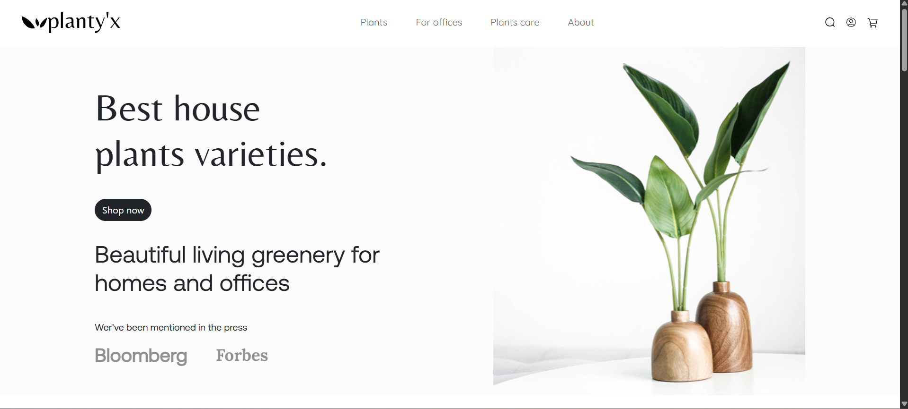
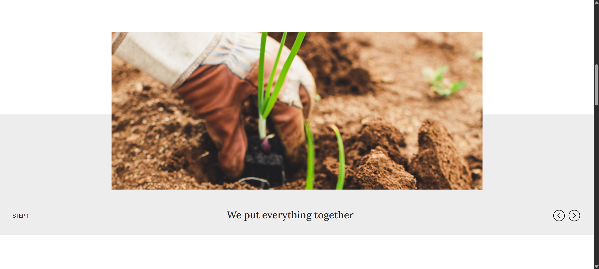
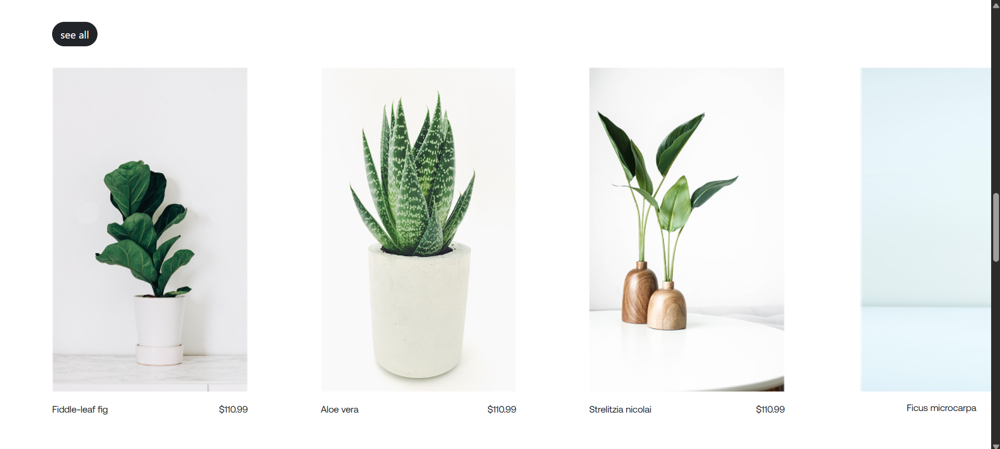
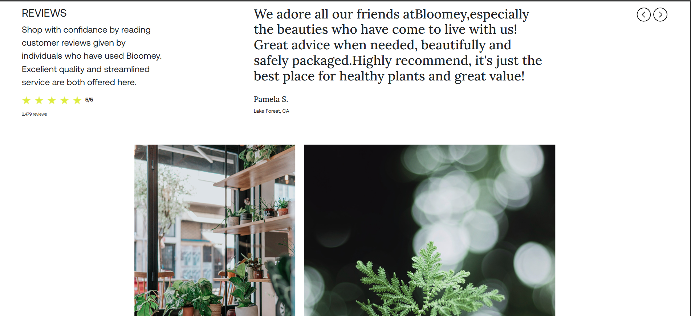
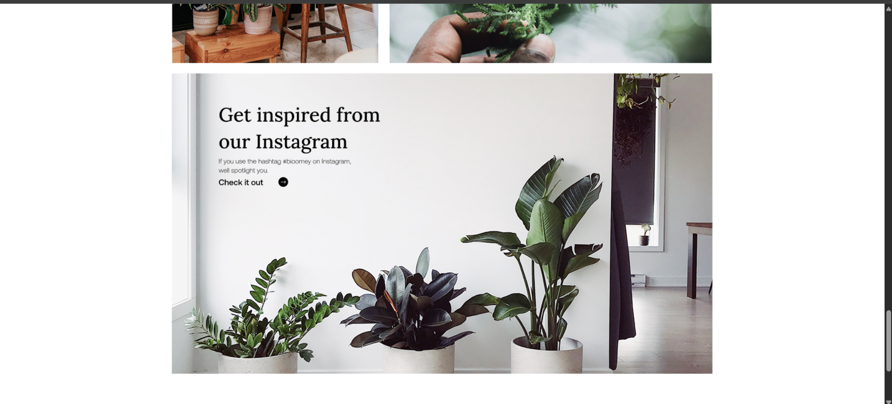
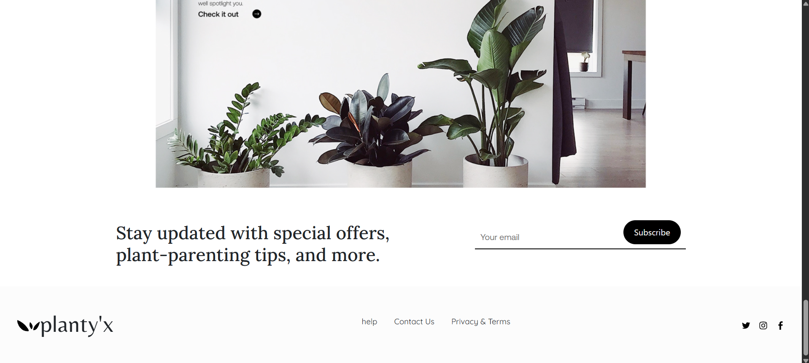

# Planty'x

Planty'x is a modern, responsive website showcasing a variety of house plants for homes and offices. It is designed with a clean layout, beautiful typography, and intuitive navigation to enhance the user experience.

## Sections in the Website

### 1. Homepage / Hero Section
- Large header with main headline: *"Best house plants varieties."*
- Call-to-action button: *"Shop now"*
- Press mentions: Bloomberg, Forbes
- Background image of plants

---

### 2. About / Info Section
- Text describing shipping, handling, and plant care
- "Learn More" area with arrow icon for additional info

---

### 3. Steps Section
- Shows the steps for handling and packaging plants
- Includes images and navigation arrows for multiple steps

---

### 4. Plant Gallery

---

### 5. Customer Reviews

---

### 6. Newsletter / Grid Images

---

